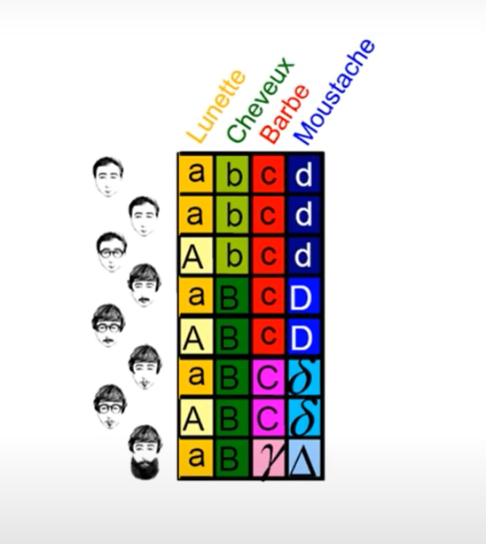
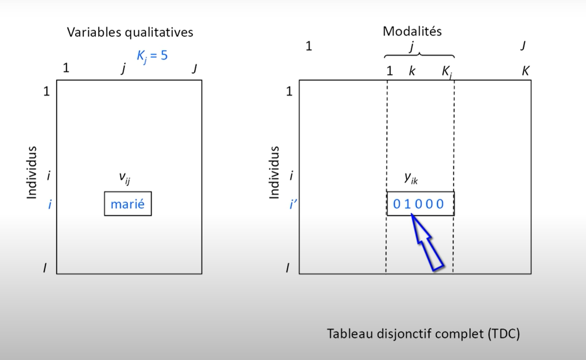
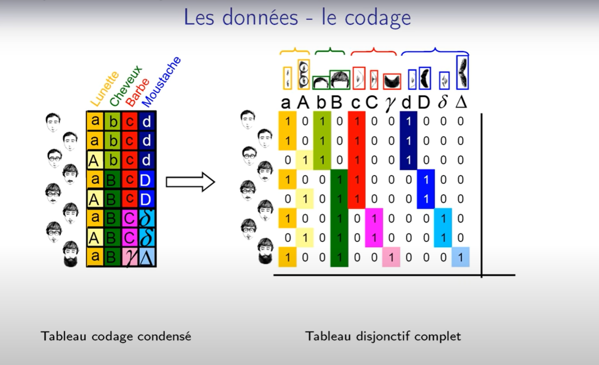
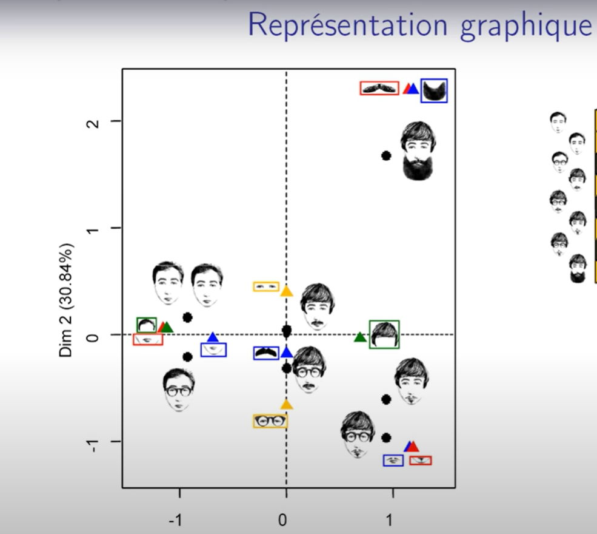

# Analyse des correspondances multiples (ACM)
## C'est quoi l'ACM
L'analyse des correspondances multiples (ACM) est une extension de l'analyse des correspondances (CA). Il doit être utilisé lorsque vous avez plus de deux variables catégorielles. L'idée est simplement de calculer la version encodée à chaud d'un ensemble de données et d'y appliquer CA. À titre d'exemple, nous allons utiliser le jeu de données [Balloons tiré](https://archive.ics.uci.edu/ml/machine-learning-databases/balloons/) du site Web des jeux de données UCI.
## Les types de données utilisées pour l'ACM
decrivons d'abord à quel tableau s'applique l'analyse des correspondances multiples(ACM): l'ACM s'applique aux tableaux rectanglaire avec J le nombre de variables qualitatives , I le nombre d'observations ou encore le nombre d'individus et xij : modalité de la variable où I personne sont intérogées sur J questions à choix multiples.

## Description de notre dataset
nous avons appliquées notre ACM sur une base de donnée qui contient 8 portraits robots
avec les variables suivantes: 
1. **lunettes**(a:absence, A: presence), 
2. **cheveux**(b:courts, B: longs), 
3. **barbe**(c: absence, C: longues, k: daltonien), 
4. **mouchetache**(d: abasence,D:petite, m:moyenne, T: grosse) 
   
## Image de notre dataset

## Explication d'une modalité
en ACM, on a la notion de tableau dijonctif complet qui signifie que dans chaque modalité on veut qu'une seule fois un(1) cet un obligatoire

## Le tableau Dijonctif

## La répresentation graphique

